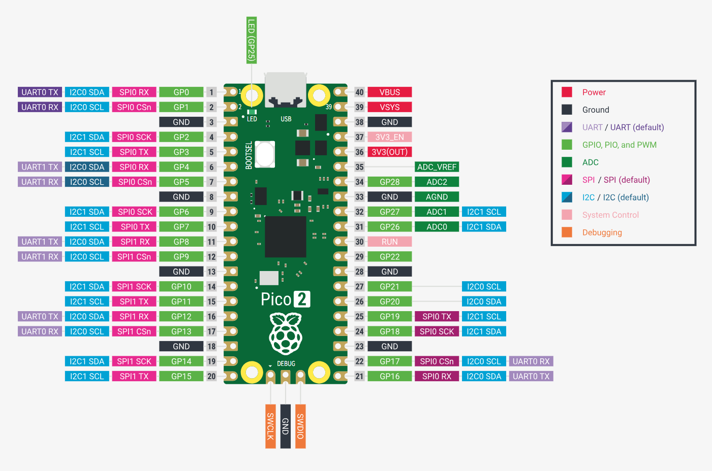

# ⚠️ 此项目正在开发中，并未真正完善

# 18通道舵机控制系统

基于 Raspberry Pi Pico 2 (RP2350) 的18通道舵机驱动系统，使用QP/C事件驱动框架实现高精度PWM控制。

## 📷 系统展示

<div align="center">
  
  
  <p><i>左：硬件系统 | 右：上位机控制界面</i></p>
</div>

### 更多展示

| 时间轴编辑器 | 运行效果 |
|-------------|---------|
|  |  |

## ✨ 系统特性

### 🎛️ 硬件控制
- ✅ **18路硬件PWM输出** - 使用RP2350的硬件PWM通道，50Hz频率，0.5μs分辨率
- ✅ **混合舵机支持** - 同时支持180度位置舵机和360度连续旋转舵机
- ✅ **360度舵机算法** - 死区补偿、加减速控制、软停止、方向切换保护
- ✅ **硬件可靠性** - PWM由硬件定时器自动生成，不受中断影响

### 🚀 运动控制（自主调度架构）
- ✅ **运动缓冲区** - Pico自主管理运动指令队列（32条）
- ✅ **时间戳调度** - 微秒级精确定时执行
- ✅ **流式上传** - 上位机流式发送，无需等待
- ✅ **梯形速度曲线** - 独立速度和加速度控制，平滑加减速
- ✅ **多轴插值** - 线性、S曲线、梯形曲线，支持18轴同步
- ✅ **多点轨迹** - 每个舵机支持最多50个路径点，自动过渡

### 💻 软件架构
- ✅ **QP/C事件驱动** - 专业级实时层次状态机框架，3个活动对象协同
- ✅ **双核优化** - Core0业务逻辑，Core1专属USB，无锁环形缓冲
- ✅ **模块化设计** - 运动调度器、缓冲区、插值器职责分离
- ✅ **USB CDC通信** - 虚拟串口，自定义二进制协议，CRC-16校验
- ✅ **Flash存储** - 舵机校准参数和起始位置持久化
- ✅ **安全保护** - 急停、超时、限位保护机制

### 🖥️ 上位机
- ✅ **图形化界面** - PyQt5时间轴编辑器，直观拖拽操作
- ✅ **流式架构** - 上位机专注编辑，Pico自主执行
- ✅ **实时监控** - 缓冲区状态、执行进度实时显示

## 🔧 硬件要求

- **主控**: Raspberry Pi Pico 2 (RP2350)
- **舵机**: 支持以下类型（可混合使用）
  - 180度位置舵机（MG995、SG90等标准PWM舵机）
  - 360度连续旋转舵机（FS90R等）
  - 90度/270度舵机（需修改配置）
- **电源**: 6V/20-30A 开关电源（舵机独立供电）
- **通信**: USB Type-C

## 📌 引脚分配

| 功能 | GPIO | 说明 |
|------|------|------|
| Servo 0-17 | GPIO 0-17 | 18路PWM输出 |
| LED | GPIO 25 | 板载LED状态指示 |
| USB | USB接口 | 虚拟串口通信 |

### Pico2引脚图


## 🏗️ 系统架构

### 完整数据流程

```
┌─────────────────────────────────────────────────────────────────────────┐
│                          上位机 (Python/PyQt5)                           │
│                                                                          │
│  ┌──────────────┐      ┌──────────────┐      ┌──────────────┐            │
│  │ 时间轴编辑器  │ →→→ │ ServoCommander│ →→→  │  SerialComm  │            │
│  │(GUI拖拽编辑) │      │  (流式命令器)  │     │  (串口通信)   │            │
│  └──────────────┘      └──────────────┘      └──────┬───────┘            │
│                                                       │                  │
│                         生成运动块序列                │                   │
│                         (时间戳+参数)                 │ USB CDC           │
└───────────────────────────────────────────────────────┼──────────────────┘
                                                        │
                                                        ↓
┌─────────────────────────────────────────────────────────────────────────┐
│                    Pico2 Core 1 (USB专用核心)                           │
│                                                                         │
│  ┌──────────────┐      ┌──────────────┐      ┌──────────────┐           │
│  │   USB CDC    │ →→→  │  USB Bridge  │ →→→  │  Ring Buffer │           │
│  │   (TinyUSB)  │      │(环形缓冲区Tx) │      │  (Core0←1)   │           │
│  └──────────────┘      └──────────────┘      └──────┬───────┘            │
│                                                       │                  │
└───────────────────────────────────────────────────────┼──────────────────┘
                                                        │
                                                        ↓
┌─────────────────────────────────────────────────────────────────────────┐
│                 Pico2 Core 0 (业务逻辑核心) - QP/C框架                   │
│                                                                         │
│  ┌─────────────────────────────────────────────────────────────────┐    │
│  │              AO_Communication (通信主动对象)                     │    │
│  │                                                                 │    │
│  │  ┌──────────────┐  ┌──────────────┐  ┌──────────────────────┐   │    │
│  │  │ USB Bridge Rx│→→│ Protocol解析 │→→│  Command Dispatcher  │   │    │
│  │  │ (环形缓冲读) │  │(CRC16校验)   │  │   (命令分发器)         │    │   │
│  │  └──────────────┘  └──────────────┘  └──────────┬───────────┘    │   │
│  │                                                   │              │   │
│  └───────────────────────────────────────────────────┼──────────────┘   │
│                                                      │                  │
│                        ┌─────────────────────────────┼──────────────┐  │
│                        │                             ↓              │  │
│                        │  ┌──────────────────────────────────────┐ │  │
│                        │  │      根据命令类型分发：               │ │  │
│                        │  │  ┌────────────────────────────────┐  │ │  │
│                        │  │  │ CMD_ADD_MOTION_BLOCK (0x40)    │  │ │  │
│                        │  │  │ ↓                              │  │ │  │
│                        │  │  │ cmd_add_motion_block()         │  │ │  │
│                        │  │  │ ↓                              │  │ │  │
│                        │  │  │ motion_scheduler_add_block()   │  │ │  │
│                        │  │  └────────────────────────────────┘  │ │  │
│                        │  │                                      │ │  │
│                        │  │  ┌────────────────────────────────┐  │ │  │
│                        │  │  │ CMD_START_MOTION (0x41)        │  │ │  │
│                        │  │  │ ↓                              │  │ │  │
│                        │  │  │ cmd_start_motion()             │  │ │  │
│                        │  │  │ ↓                              │  │ │  │
│                        │  │  │ motion_scheduler_start()       │  │ │  │
│                        │  │  └────────────────────────────────┘  │ │  │
│                        │  └──────────────────────────────────────┘ │  │
│                        └───────────────────────────────────────────┘  │
│                                                      │                  │
│                                                      ↓                  │
│  ┌─────────────────────────────────────────────────────────────────┐   │
│  │                  Motion Scheduler (运动调度器)                   │   │
│  │                                                                  │   │
│  │  ┌──────────────────────────────────────────────────────────┐  │   │
│  │  │           Motion Buffer (32条指令FIFO队列)               │  │   │
│  │  │                                                          │  │   │
│  │  │  [0] {ts=0ms,    S1, 90°,  v=30, a=60}                  │  │   │
│  │  │  [1] {ts=1000ms, S1, 180°, v=30, a=60}                  │  │   │
│  │  │  [2] {ts=2000ms, S2, 45°,  v=50, a=100}                 │  │   │
│  │  │  [3] ...                                                │  │   │
│  │  │                                                          │  │   │
│  │  └──────────────────────────────────────────────────────────┘  │   │
│  │                           │                                     │   │
│  │              每20ms检查一次 (INTERP_TICK_SIG)                   │   │
│  │                           ↓                                     │   │
│  │  ┌──────────────────────────────────────────────────────────┐  │   │
│  │  │  motion_scheduler_update()                              │  │   │
│  │  │                                                          │  │   │
│  │  │  1. 获取当前时间                                          │  │   │
│  │  │  2. peek下一条指令                                        │  │   │
│  │  │  3. 时间戳匹配？                                          │  │   │
│  │  │     ├─ 否 → 等待                                         │  │   │
│  │  │     └─ 是 → 执行回调                                     │  │   │
│  │  │             motion_execute_trapezoid_callback()         │  │   │
│  │  │             ↓                                            │  │   │
│  │  │             AO_Motion_set_trapezoid()                   │  │   │
│  │  │             ↓                                            │  │   │
│  │  │             POST(MOTION_START_SIG)                      │  │   │
│  │  │                                                          │  │   │
│  │  └──────────────────────────────────────────────────────────┘  │   │
│  └─────────────────────────────┬────────────────────────────────────┘   │
│                                │                                        │
│                                ↓                                        │
│  ┌─────────────────────────────────────────────────────────────────┐   │
│  │                AO_Motion (运动主动对象)                          │   │
│  │                                                                  │   │
│  │  ┌──────────────────────────────────────────────────────────┐  │   │
│  │  │              QP/C状态机 (Event-Driven)                   │  │   │
│  │  │                                                          │  │   │
│  │  │   IDLE状态                                               │  │   │
│  │  │     │                                                    │  │   │
│  │  │     ├─ INTERP_TICK_SIG → motion_scheduler_update()     │  │   │
│  │  │     │                                                    │  │   │
│  │  │     └─ MOTION_START_SIG → 转换到MOVING状态              │  │   │
│  │  │                              │                           │  │   │
│  │  │   MOVING状态                 │                           │  │   │
│  │  │     │◄──────────────────────┘                           │  │   │
│  │  │     │                                                    │  │   │
│  │  │     └─ INTERP_TICK_SIG → interpolator_update()         │  │   │
│  │  │                              ↓                           │  │   │
│  │  └──────────────────────────────┼───────────────────────────┘  │   │
│  └─────────────────────────────────┼──────────────────────────────┘   │
│                                    │                                   │
└────────────────────────────────────┼───────────────────────────────────┘
                                     │
                                     ↓
┌─────────────────────────────────────────────────────────────────────────┐
│                      Interpolation (插值计算层)                          │
│                                                                          │
│  ┌──────────────────────────────────────────────────────────────────┐  │
│  │         interpolator_update() - 每20ms调用一次                    │  │
│  │                                                                   │  │
│  │   根据插值类型选择算法：                                           │  │
│  │                                                                   │  │
│  │   ┌─────────────────────────────────────────────────────────┐   │  │
│  │   │  INTERP_TYPE_TRAPEZOID (梯形速度曲线)                    │   │  │
│  │   │                                                         │   │  │
│  │   │  interpolator_update_trapezoid():                      │   │  │
│  │   │                                                         │   │  │
│  │   │  1. 计算三段时间                                         │   │  │
│  │   │     ├─ t_accel  = v / a                                │   │  │
│  │   │     ├─ t_const  = (distance - accel_dist - decel_dist)/v│   │  │
│  │   │     └─ t_decel  = v / d                                │   │  │
│  │   │                                                         │   │  │
│  │   │  2. 根据当前时间判断所处阶段                              │   │  │
│  │   │     ├─ 加速段：pos = 0.5 * a * t²                      │   │  │
│  │   │     ├─ 匀速段：pos = accel_dist + v * (t - t_accel)   │   │  │
│  │   │     └─ 减速段：pos = total - 0.5 * d * (t_total - t)² │   │  │
│  │   │                                                         │   │  │
│  │   │  3. 返回当前角度                                         │   │  │
│  │   │     current_pos = start_pos + Δpos                     │   │  │
│  │   │                                                         │   │  │
│  │   └─────────────────────────────────────────────────────────┘   │  │
│  │                                                                   │  │
│  │   ┌─────────────────────────────────────────────────────────┐   │  │
│  │   │  INTERP_TYPE_LINEAR (线性插值)                           │   │  │
│  │   │                                                         │   │  │
│  │   │  pos = start + (end - start) * (elapsed / duration)    │   │  │
│  │   │                                                         │   │  │
│  │   └─────────────────────────────────────────────────────────┘   │  │
│  │                                                                   │  │
│  │   ┌─────────────────────────────────────────────────────────┐   │  │
│  │   │  INTERP_TYPE_S_CURVE (S曲线插值)                         │   │  │
│  │   │                                                         │   │  │
│  │   │  ratio = t² * (3 - 2t)  (smoothstep函数)              │   │  │
│  │   │  pos = start + (end - start) * ratio                   │   │  │
│  │   │                                                         │   │  │
│  │   └─────────────────────────────────────────────────────────┘   │  │
│  │                                                                   │  │
│  └───────────────────────────────┬───────────────────────────────────┘  │
└─────────────────────────────────┼──────────────────────────────────────┘
                                  │
                                  ↓ 返回当前角度 (float)
┌─────────────────────────────────────────────────────────────────────────┐
│                     Servo Control (舵机控制层)                           │
│                                                                          │
│  ┌──────────────────────────────────────────────────────────────────┐  │
│  │                  servo_set_angle(id, angle)                       │  │
│  │                                                                   │  │
│  │  1. 检查角度范围（0-180度）                                        │  │
│  │     ├─ 超限 → 返回错误                                            │  │
│  │     └─ 合法 → 继续                                                │  │
│  │                                                                   │  │
│  │  2. 角度转脉宽                                                     │  │
│  │     servo_angle_to_pulse(id, angle)                              │  │
│  │     ↓                                                             │  │
│  │     pulse = min_pulse + (angle/180) * (max_pulse - min_pulse)   │  │
│  │           + offset                                               │  │
│  │     ↓                                                             │  │
│  │     应用校准参数（反转、偏移）                                       │  │
│  │     ↓                                                             │  │
│  │     pulse_us = 500 ~ 2500μs                                      │  │
│  │                                                                   │  │
│  │  3. 更新舵机状态                                                   │  │
│  │     g_servos[id].current_angle = angle                           │  │
│  │     g_servos[id].current_pulse_us = pulse_us                     │  │
│  │                                                                   │  │
│  └───────────────────────────────┬───────────────────────────────────┘  │
└─────────────────────────────────┼──────────────────────────────────────┘
                                  │
                                  ↓ pulse_us
┌─────────────────────────────────────────────────────────────────────────┐
│                       PWM Driver (PWM驱动层)                             │
│                                                                          │
│  ┌──────────────────────────────────────────────────────────────────┐  │
│  │                  pwm_set_pulse(id, pulse_us)                      │  │
│  │                                                                   │  │
│  │  1. 计算PWM占空比                                                  │  │
│  │     周期 = 20ms (50Hz)                                            │  │
│  │     占空比 = pulse_us / 20000                                     │  │
│  │             = 500~2500 / 20000                                   │  │
│  │             = 2.5% ~ 12.5%                                       │  │
│  │                                                                   │  │
│  │  2. 转换为计数值                                                   │  │
│  │     PWM时钟 = 2MHz                                                │  │
│  │     周期计数 = 2MHz * 20ms = 40000                                │  │
│  │     高电平计数 = pulse_us * 2 (1μs = 2个计数)                      │  │
│  │                                                                   │  │
│  │  3. 写入硬件寄存器                                                 │  │
│  │     pwm_set_chan_level(slice, channel, level)                   │  │
│  │     ↓                                                             │  │
│  │     RP2350硬件PWM自动生成波形                                      │  │
│  │                                                                   │  │
│  └───────────────────────────────┬───────────────────────────────────┘  │
└─────────────────────────────────┼──────────────────────────────────────┘
                                  │
                                  ↓ 硬件PWM信号
┌─────────────────────────────────────────────────────────────────────────┐
│                          物理输出 (GPIO)                                 │
│                                                                          │
│   GPIO 0-17 输出PWM波形                                                  │
│                                                                          │
│   ┌────┐              ┌────┐              ┌────┐                       │
│   │    │              │    │              │    │                       │
│   │    │              │    │              │    │                       │
│ ──┘    └──────────────┘    └──────────────┘    └──────────            │
│   │←500~2500μs→│                                                        │
│   │←────────── 20ms (50Hz) ─────────→│                                 │
│                                                                          │
│   → 舵机接收并转动到指定角度                                              │
│                                                                          │
└──────────────────────────────────────────────────────────────────────────┘
```

### 关键流程总结

1. **上位机** - 时间轴编辑 → 生成运动块
2. **USB传输** - Core1接收 → 环形缓冲区
3. **协议解析** - CRC校验 → 命令分发
4. **运动调度** - 时间戳匹配 → 自主执行
5. **状态机** - IDLE/MOVING切换
6. **插值计算** - 梯形曲线 → 实时角度
7. **舵机控制** - 角度 → 脉宽 (500~2500μs)
8. **PWM输出** - 硬件生成 → 舵机转动

### 嵌入式端 (QP/C框架)

```
RP2350 (Cortex-M33 @ 150MHz)
├── QP/C 7.3.4 (QV Kernel)       # 事件驱动框架
│   ├── AO_Communication          # 通信主动对象（优先级3）
│   │   ├── USB Bridge通信
│   │   ├── 协议解析
│   │   └── 命令分发
│   ├── AO_Motion                 # 运动主动对象（优先级2）
│   │   ├── 运动插值（20ms周期）
│   │   ├── 梯形速度曲线规划
│   │   ├── 50点轨迹队列管理
│   │   └── 18轴同步控制
│   └── AO_System                 # 系统主动对象（优先级1）
│       ├── LED状态指示（1s）
│       ├── 错误处理
│       └── Flash存储管理
│
├── Motion Modules（运动模块 - v2.0优化）
│   ├── motion_scheduler.c      # 时间戳自主调度器
│   ├── motion_buffer.c         # 32条指令FIFO缓冲区
│   └── interpolation.c         # 插值算法（线性/S曲线/梯形）
│
├── USB Bridge                   # Core1独占USB，避免双核冲突
├── 硬件PWM（18通道）            # 2MHz时钟，0.5μs分辨率
├── 180度舵机控制                # 角度→脉宽转换，校准
├── 360度舵机控制                # 速度控制，加减速，死区补偿
└── Flash存储                    # 参数和位置持久化
```

### 上位机端 (PyQt5)

```
ControlManagementSystem/
├── 主窗口 (MainWindow)
│   ├── 工具栏（连接、运行、停止、使能控制）
│   ├── 串口日志（协议过滤、自动滚动）
│   └── 舵机状态显示
│
├── 时间轴编辑器 (TimelineWidget)
│   ├── 18条舵机轨道
│   ├── 运动组件（正转、反转、回中、延时）
│   ├── 拖放编辑
│   └── 时间刻度尺
│
├── 核心模块
│   ├── SerialComm - 串口通信和协议（含缓冲区命令）
│   ├── ServoCommander - 流式命令器（v2.0整合架构）
│   ├── ProjectManager - 项目保存/加载
│   └── ConfigManager - 配置管理
│
└── 对话框
    ├── 舵机参数设置（18通道、角度范围）
    ├── 运动组件编辑
    ├── 默认参数配置
    └── 运动逻辑表显示
```

## 🚀 快速开始

### 1. 编译固件

#### 使用 PlatformIO IDE

```bash
# 安装依赖（首次）
pio pkg install

# 编译固件
pio run

# 上传到Pico2（按住BOOTSEL按钮连接USB）
pio run -t upload

# 串口监视器（查看调试信息）
pio device monitor
```

#### 调试开关

编辑 `include/config/config.h` 中的调试宏：
```c
// 主调试开关
#define DEBUG_ENABLE            1       // 总开关

// 模块调试开关
#define DEBUG_USB               0       // USB通信调试
#define DEBUG_PROTOCOL          0       // 协议解析调试
#define DEBUG_COMMAND           0       // 命令处理调试
#define DEBUG_AO_COMM           0       // AO通信调试
#define DEBUG_AO_MOTION         0       // AO运动调试
#define DEBUG_AO_SYSTEM         0       // AO系统调试
#define DEBUG_MOTION            0       // 运动插值调试
#define DEBUG_SERVO             0       // 舵机控制调试
#define DEBUG_PWM               0       // PWM输出调试
#define DEBUG_FLASH             0       // Flash存储调试
#define DEBUG_STARTUP           1       // 启动信息（建议开启）
#define DEBUG_PARAM             0       // 参数管理调试
```

**使用建议**：
- 日常使用：仅开启 `DEBUG_STARTUP` 查看启动信息
- 调试运动：开启 `DEBUG_AO_MOTION` 和 `DEBUG_MOTION`
- 调试通信：开启 `DEBUG_PROTOCOL` 和 `DEBUG_COMMAND`
- 调试Flash：开启 `DEBUG_PARAM`

### 2. 安装上位机

```bash
cd ControlManagementSystem

# 安装Python依赖
pip install -r requirements.txt

# 运行上位机
python main.py
```

### 3. 基本使用流程

1. **连接设备**
   - 点击"连接"按钮，选择COM口
   - 看到"串口连接成功"提示

2. **使能舵机**
   - 点击"全部使能"按钮（变绿色）
   - 或单独点击舵机轨道名称使能

3. **编程运动序列**
   - 从组件面板拖动运动组件到时间轴
   - 双击组件编辑参数：
     * **目标角度**：0-180°
     * **运动模式**：基于时间 / 梯形速度
     * **基于时间**：设置运动时间（毫秒）
     * **梯形速度**：设置速度（°/s）、加速度（°/s²）

4. **执行程序**
   - 点击"运行"按钮
   - 观察舵机运动和日志输出
   - 系统自动处理混合运动模式

5. **保存项目**
   - 文件 → 保存项目
   - 下次可直接加载（包含运动模式参数）

## 🎮 运动模式详解

系统支持两种运动控制模式，可在上位机中为每个运动部件单独设置：

### **模式1：基于时间（Time-Based）**

**特点**：
- 指定运动时间，系统自动计算速度
- 简单直观，适合定时运动
- 向后兼容，默认模式

**参数**：
- 运动时间：100-10000ms

**示例**：
```
舵机0从30°移动到150°，用时2000ms
→ 自动速度 = 120° / 2s = 60°/s（不可控）
```

---

### **模式2：梯形速度（Trapezoid Velocity）**

**特点**：
- 指定速度和加速度，系统自动计算时间
- 平滑加减速，运动更自然
- 速度可控，适合精确控制

**参数**：
- 速度：1-180°/s
- 加速度：1-500°/s²
- 减速度：0-500°/s²（0表示使用加速度值）

**运动曲线**：
```
速度
  ↑
  │    ╱‾‾‾‾‾╲     标准梯形
  │   ╱       ╲    - 加速阶段
  │  ╱         ╲   - 匀速阶段
  │ ╱           ╲  - 减速阶段
  └─────────────→ 时间

速度
  ↑
  │     ╱╲         三角形（距离短）
  │    ╱  ╲        - 加速阶段
  │   ╱    ╲       - 减速阶段
  │  ╱      ╲      - 无匀速阶段
  └──────────→ 时间
```

**示例**：
```
舵机0从30°移动到150°，速度30°/s，加速度60°/s²
→ 自动计算时间：约5.5秒
→ 平滑加减速运动
```

---

### **使用建议**

| 场景 | 推荐模式 | 原因 |
|------|---------|------|
| 简单定时动作 | 基于时间 | 简单直观 |
| 精确速度控制 | 梯形速度 | 速度可控 |
| 需要平滑运动 | 梯形速度 | 自动加减速 |
| 机器人关节 | 梯形速度 | 更自然 |
| 同步运动 | 基于时间 | 时间统一 |

---

### **多点轨迹规划**

**功能**：
- 支持最多50个路径点
- 自动点到点平滑过渡
- 每个点可设置停留时间
- 支持循环播放

**使用方法（Python脚本）**：
```python
from ControlManagementSystem.core.serial_comm import SerialComm

comm = SerialComm()
comm.connect("COM3")

# 清空轨迹
comm.trajectory_clear(0)

# 添加轨迹点（位置、速度、加速度、停留时间）
comm.trajectory_add_point(0, 0.0, velocity=30.0, acceleration=60.0, dwell_time_ms=500)
comm.trajectory_add_point(0, 90.0, velocity=45.0, acceleration=90.0, dwell_time_ms=1000)
comm.trajectory_add_point(0, 180.0, velocity=30.0, acceleration=60.0, dwell_time_ms=500)

# 开始循环执行
comm.trajectory_start(0, loop=True)

# 停止轨迹
comm.trajectory_stop(0)
```

---

## 📡 通信协议

### 帧格式

```
[0xFF] [0xFE] [ID] [CMD] [LEN] [DATA...] [CRC_H] [CRC_L]
```

**字段说明：**
- **帧头**: `FF FE` (固定)
- **ID**: 设备ID (`0x00`=广播, `0x01-0xFE`=单播)
- **CMD**: 命令字节
- **LEN**: 数据长度（不包括帧头、ID、CMD、LEN、CRC）
- **DATA**: 命令数据
- **CRC**: CRC-16 CCITT校验（计算范围：ID到DATA结束）

### 命令集

#### 位置控制命令

| 命令 | 代码 | 数据格式 | 说明 |
|------|------|----------|------|
| MOVE_SINGLE | 0x01 | `[ID] [角度H] [角度L] [时间H] [时间L]` | 单轴移动（基于时间） |
| MOVE_MULTI | 0x02 | `[轴数] [ID0] [角度H] [角度L] ...` | 多轴选择性移动 |
| MOVE_ALL | 0x03 | `[角度0H] [角度0L] ... [角度17H] [角度17L] [时间H] [时间L]` | 18轴同步移动 |
| MOVE_TRAPEZOID | 0x04 | `[ID] [角度H] [角度L] [速度H] [速度L] [加速H] [加速L] [减速H] [减速L]` | 单轴梯形速度运动 |

**参数编码：**
- 角度：`angle_int = angle × 100` (例如90.5° = 9050)
- 速度：`velocity_int = velocity × 10` (例如30.5°/s = 305)
- 加速度：`accel_int = accel × 10` (例如60.5°/s² = 605)

#### 轨迹规划命令

| 命令 | 代码 | 数据格式 | 说明 |
|------|------|----------|------|
| TRAJ_ADD_POINT | 0x06 | `[ID] [位置H] [位置L] [速度H] [速度L] [加速H] [加速L] [减速H] [减速L] [停留H] [停留L]` | 添加轨迹点 |
| TRAJ_START | 0x07 | `[ID] [循环]` | 开始执行轨迹 (循环: 0=否, 1=是) |
| TRAJ_STOP | 0x08 | `[ID]` | 停止轨迹执行 |
| TRAJ_CLEAR | 0x09 | `[ID]` | 清空轨迹队列 |
| TRAJ_GET_INFO | 0x0A | `[ID]` | 查询轨迹信息 |

#### 查询命令

| 命令 | 代码 | 数据格式 | 返回数据 |
|------|------|----------|----------|
| GET_SINGLE | 0x10 | `[舵机ID]` | `[ID] [角度H] [角度L] [使能]` |
| GET_ALL | 0x11 | 无 | `[ID0] [角度H] [角度L] [ID1] ...` (54字节) |

#### 配置命令

| 命令 | 代码 | 数据格式 | 说明 |
|------|------|----------|------|
| ENABLE | 0x20 | `[舵机ID]` | 使能舵机（`0xFF`=全部） |
| DISABLE | 0x21 | `[舵机ID]` | 失能舵机（`0xFF`=全部） |

#### 存储命令

| 命令 | 代码 | 数据格式 | 说明 |
|------|------|----------|------|
| SAVE_FLASH | 0x30 | 无 | 保存校准参数到Flash |
| LOAD_FLASH | 0x31 | 无 | 从Flash加载校准参数 |
| SET_START_POSITIONS | 0x33 | `[角度0H] [角度0L] ... [角度17H] [角度17L]` | 设置起始位置到Flash |

#### 系统命令

| 命令 | 代码 | 数据格式 | 说明 |
|------|------|----------|------|
| PING | 0xFE | 无 | 心跳检测，返回"PONG" |
| ESTOP | 0xFF | 无 | 紧急停止，立即停止所有PWM |

### 响应码

| 代码 | 含义 |
|------|------|
| 0x00 | 成功 |
| 0x01 | 错误 |
| 0x02 | 无效命令 |
| 0x03 | 无效参数 |
| 0x04 | CRC错误 |
| 0x05 | 超时 |
| 0x06 | 繁忙 |

## 🧪 测试工具

### 功能测试脚本 (`test_servo.py`)

自动测试所有协议命令：

```bash
python test_servo.py
```

**测试内容：**
1. PING - 心跳检测
2. ENABLE_SINGLE - 使能单个舵机
3. ENABLE_ALL - 使能所有舵机
4. MOVE_SINGLE - 单轴移动
5. MOVE_ALL - 全轴同步移动
6. GET_SINGLE - 查询单轴状态
7. GET_ALL - 查询全轴状态
8. DISABLE_SINGLE - 失能舵机

**测试报告：** 自动保存到 `test_servo_log.txt`

### 图形化上位机 (`ControlManagementSystem/`)

专业级舵机编程工具：

```bash
cd ControlManagementSystem
python main.py
```

**核心功能：**
- ✅ 可视化时间轴编辑器
- ✅ 18路舵机独立轨道（编号0-17）
- ✅ 运动组件拖放编辑
- ✅ 双运动模式支持（基于时间 / 梯形速度）
- ✅ 速度和加速度参数编辑
- ✅ 实时串口通讯监控
- ✅ 项目保存/加载（JSON格式）
- ✅ 命令序列导出和预览
- ✅ 运动逻辑表生成
- ✅ 全部/单独舵机使能控制
- ✅ 手动Jog功能（±10°微调）

## 📁 代码结构

```
Pico2_18channelServoDriverSystem/
├── platformio.ini                    # PlatformIO配置
├── lib/
│   └── qpc_7.3.4_qv/                # QP/C框架源码
├── src/                              # 嵌入式源代码
│   ├── main.c                        # 主程序，QP/C初始化
│   ├── qp_port_init.c               # QP/C移植层（SysTick等）
│   ├── ao/                           # 主动对象（Active Objects）
│   │   ├── ao_communication.c/h     # 通信AO（USB, 协议解析）
│   │   ├── ao_motion.c/h            # 运动AO（插值，轨迹）
│   │   └── ao_system.c/h            # 系统AO（监控，LED，Flash）
│   ├── communication/                # 通信模块
│   │   ├── protocol.c/h             # 协议解析器
│   │   ├── crc16.c/h                # CRC-16校验
│   │   └── usb_handler.c/h          # USB CDC处理（保留）
│   ├── events/                       # 事件定义
│   │   ├── events.h                 # 事件信号枚举
│   │   └── event_types.h            # 事件数据结构
│   ├── pwm/                          # PWM驱动
│   │   └── pwm_driver.c/h           # 硬件PWM控制
│   ├── servo/                        # 舵机控制
│   │   ├── servo_control.c/h        # 180度位置舵机
│   │   ├── servo_360.c/h            # 360度连续旋转舵机
│   │   └── servo_manager.c/h        # 统一管理器
│   ├── motion/                       # 运动控制
│   │   └── interpolation.c/h        # 多轴插值算法
│   ├── storage/                      # 存储管理
│   │   ├── flash_storage.c/h        # Flash读写
│   │   └── param_manager.c/h        # 参数管理
│   └── utils/                        # 工具模块
│       ├── ring_buffer.c/h          # 环形缓冲区
│       └── error_handler.c/h        # 错误处理
│
├── include/                          # 头文件
│   ├── config/
│   │   ├── config.h                 # 系统参数
│   │   └── pinout.h                 # GPIO定义
│   ├── qp_config.h                  # QP/C配置
│   └── [各模块头文件目录]
│
├── ControlManagementSystem/          # 上位机程序（Python + PyQt5）
│   ├── main.py                       # 启动入口
│   ├── ui/                           # UI模块
│   │   ├── main_window.py           # 主窗口
│   │   ├── timeline_widget.py       # 时间轴编辑器
│   │   ├── motor_track.py           # 舵机轨道
│   │   ├── component_palette.py     # 组件面板
│   │   └── dialogs.py               # 对话框
│   ├── core/                         # 核心逻辑
│   │   ├── serial_comm.py           # 串口通信
│   │   ├── servo_commander.py       # 命令生成器
│   │   ├── project_manager.py       # 项目管理
│   │   ├── config_manager.py        # 配置管理
│   │   └── logger.py                # 日志系统
│   ├── models/                       # 数据模型
│   │   ├── component.py             # 运动组件
│   │   └── timeline_data.py         # 时间轴数据
│   └── tools/                        # 调试工具
│       ├── ai_debug.py              # AI调试助手
│       └── log_analyzer.py          # 日志分析
│
├── test_servo.py                     # 功能测试脚本
├── test_servo_log.txt               # 测试报告（自动生成）
├── requirements.txt                  # Python依赖
└── SERVO_360_GUIDE.md               # 360度舵机指南
```

## ⚙️ 性能指标

| 指标 | 数值 | 说明 |
|------|------|------|
| **CPU** | RP2350 @ 150MHz | 双核Cortex-M33（Core0业务 + Core1 USB） |
| **框架** | QP/C 7.3.4 (QV) | 事件驱动，协作式内核 |
| **PWM频率** | 50Hz | 标准舵机频率 |
| **PWM分辨率** | 0.5μs | 2MHz时钟，40000计数 |
| **插值周期** | 20ms | 与PWM周期同步 |
| **插值算法** | 3种 | 线性、S曲线、梯形速度 |
| **轨迹容量** | 50点/舵机 | 18个舵机×50点 = 900点总容量 |
| **通信接口** | USB CDC | TinyUSB实现 |
| **通信速率** | 115200 bps | 虚拟串口 |
| **命令响应** | <20ms | 单轴命令 |
| **命令响应** | <30ms | 18轴同步命令 |
| **Flash存储** | 256KB偏移 | 参数和位置持久化 |
| **内存占用** | <85KB RAM | 包含轨迹队列（264KB可用） |
| **CPU占用** | <5% | 运动规划和插值开销 |

## 🎯 应用场景

### 180度位置舵机应用
- 🤖 **六足机器人** - 每条腿3个舵机（18自由度）
- 🦾 **多关节机械臂** - 精确位置控制
- 🎭 **仿生机器人** - 复杂关节运动
- 📷 **云台控制** - 双轴/三轴云台

### 360度连续旋转舵机应用
- 🚗 **移动机器人底盘** - 轮式驱动
- 📦 **传送带机构** - 持续旋转输送
- 🔄 **旋转平台** - 展示台、转盘

### 混合应用
- 🦾🚗 **机械臂+移动底盘** - 6个关节+2个轮子
- 🤖 **教育机器人平台** - 灵活的关节和轮子配置
- 🎯 **自动化设备** - 复杂的运动组合

## 🔧 配置说明

### platformio.ini 关键配置

```ini
[env:pico2]
platform = file://platform-raspberrypi-develop/platform-raspberrypi-develop
board = rpipico2
framework = picosdk

build_flags = 
    -DPICO_STACK_SIZE=0x1000          # 栈大小4KB
    -DPICO_PRINTF_ALWAYS_INCLUDED=1   # 启用printf
    -DPICO_FLOAT_SUPPORT_ROM_V1=1     # 浮点支持
```

### config.h 系统参数

```c
#define SERVO_COUNT             18          // 舵机数量
#define SERVO_MIN_PULSE_US      500         // 最小脉宽 (μs)
#define SERVO_MAX_PULSE_US      2500        // 最大脉宽 (μs)
#define PWM_FREQUENCY_HZ        50          // PWM频率 50Hz
#define TIME_EVENT_INTERP_MS    20          // 插值周期 20ms
```

## 🐛 故障排查

### Q: 舵机不动？
**检查清单：**
1. ✅ 舵机电源是否连接（6V/大电流）
2. ✅ GPIO引脚连接是否正确（GPIO 0-17）
3. ✅ 舵机是否使能（点击"全部使能"或单个使能）
4. ✅ 上位机是否显示"连接成功"
5. ✅ 串口日志是否有响应

### Q: 舵机抖动？
**可能原因：**
1. ❌ 电源供电不足（需要大电流电源）
2. ❌ 信号线过长或有干扰
3. ❌ 校准参数不正确
4. ❌ PWM频率不匹配（应为50Hz）

### Q: 通信无响应？
**检查清单：**
1. ✅ USB连接是否正常
2. ✅ 串口号是否正确
3. ✅ 单片机LED是否闪烁（1秒1次）
4. ✅ CRC校验是否通过
5. ✅ 固件是否最新版本

**调试方法：**
```bash
# 运行测试脚本
python test_servo.py

# 查看测试报告
cat test_servo_log.txt
```

### Q: LED不闪烁或快速闪烁？
**LED状态含义：**
- **1秒闪烁** - 正常运行 ✅
- **200ms闪烁** - 错误状态 ⚠️
- **50ms闪烁** - 紧急停止 🚨
- **不闪烁** - 程序崩溃或未启动 ❌

### Q: 如何使用360度舵机？
**步骤：**
1. 通过上位机配置舵机类型为360度模式
2. 使用速度控制命令（-100到+100）
3. 详见 `SERVO_360_GUIDE.md`

## 📚 开发文档

- [功能需求文档](功能需求文档.md) - 项目需求和规格
- [360度舵机指南](SERVO_360_GUIDE.md) - 360度舵机详细说明
- [QP/C迁移总结](QPC_MIGRATION_SUCCESS.md) - 从FreeRTOS到QP/C的迁移记录
- [项目概览](PROJECT_OVERVIEW.md) - 系统架构和设计
- [实现总结](IMPLEMENTATION_SUMMARY.md) - 实现细节

## 🔄 开发路线图

- [x] **Phase 1**: 基础PWM功能（18路硬件PWM）
- [x] **Phase 2**: 通信协议（USB CDC + 自定义协议）
- [x] **Phase 3**: 运动控制（插值算法）
- [x] **Phase 4**: 参数存储（Flash持久化）
- [x] **Phase 5**: QP/C迁移（事件驱动架构）
- [x] **Phase 6**: 上位机开发（PyQt5 GUI）
- [x] **Phase 7**: 360度舵机支持
- [x] **Phase 8**: 高级运动规划（梯形速度 + 50点轨迹）
- [x] **Phase 9**: 架构优化 v2.0 🎉
  - [x] 运动调度器模块化（motion_scheduler.c）
  - [x] 流式缓冲区架构（CNC式自主调度）
  - [x] 上位机流式命令器整合
  - [x] 代码清理（删除usb_handler冗余）
  - [x] 职责分离优化（ao_motion简化63行）
- [ ] **Phase 10**: ROS2集成
- [ ] **Phase 11**: 性能优化和压力测试

## 🛠️ 技术栈

### 嵌入式端
- **硬件平台**: Raspberry Pi Pico 2 (RP2350)
- **开发框架**: Pico SDK 2.0
- **实时框架**: QP/C 7.3.4 (Quantum Platform)
- **构建工具**: PlatformIO + CMake
- **通信协议**: USB CDC (TinyUSB)
- **编程语言**: C99

### 上位机端
- **编程语言**: Python 3.8+
- **GUI框架**: PyQt5
- **串口通信**: pyserial
- **项目格式**: JSON

## 🔐 安全注意事项

⚠️ **重要安全提示：**

1. **电源隔离**
   - 舵机电源必须独立供电
   - 不要从Pico 2的VSYS供电
   - 峰值电流可达30-45A

2. **急停按钮**
   - 上位机提供软件急停
   - 建议添加硬件急停开关
   - 紧急情况下拔掉舵机电源

3. **限位保护**
   - 180度舵机：0-180度软限位
   - 360度舵机：3秒超时保护
   - PWM脉宽：500-2500μs硬限位

4. **测试建议**
   - 首次使用先单个舵机测试
   - 确认角度方向正确
   - 从低速度开始测试
   - 准备好急停按钮

## 📄 许可证

MIT License

Copyright (c) 2025 18通道舵机控制系统

## 📞 技术支持

- **问题反馈**: GitHub Issues
- **测试工具**: `test_servo.py` 自动测试所有功能
- **调试指南**: 开启 `USB_DEBUG_ENABLE` 查看详细日志

---

**Version**: 2.1.0-QPC  
**Last Updated**: 2025-10-25  
**Status**: ✅ 稳定运行

**最新更新 (v2.1.0)**:
- ✨ 新增梯形速度曲线运动控制
- ✨ 新增50点轨迹规划系统
- ✨ 上位机支持运动模式切换（基于时间/梯形速度）
- ✨ 混合运动模式自动处理
- 🔧 优化调试宏系统，统一管理调试输出
- 🔧 上位机舵机编号改为0-17与MCU一致

**注意**: 
- 舵机电源必须独立供电，峰值电流可达45A！
- 首次使用请先运行 `test_servo.py` 测试所有功能
- 上位机图形界面提供完整的编程和调试功能
- 梯形速度模式提供更平滑的运动曲线
